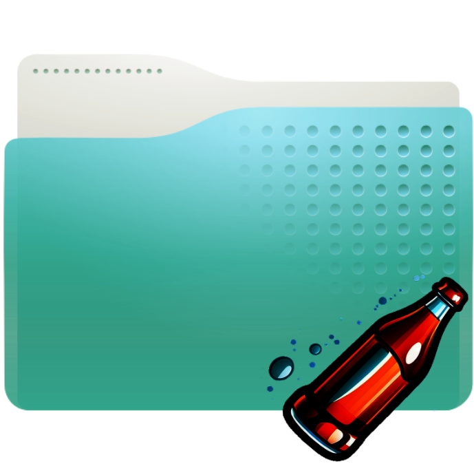

# SoftDrink
A directory launcher/shortcut system for Linux desktops with GNOME Files (Nautilus) file manager (Ubuntu, Fedora etc)

  
  

## What's with the name? 
softdrink is a wordplay on softlink, or a soft (symbolic) link

## What does it do? 
In some way it mimics the shortcuts available on Windows machine. Allows you to create shortcuts to directories. You double-click on the shortcut and that directory is opened in a file browser. The location bar shows the original path to the directory. 

## Where can I place these 'shortcuts'?
Wherever you want, as many as you want. 
No restrictions on placing them on the desktop or in any other directory. 

## Why would I need this? 
To easily access related places from a folder. They work not just as a launcher, but also as handy bookmarks. 

## How is this different from creating a soft link to target directory? 
In a way, softdrink is a dumbed down version of soft link. 

Value of softlinks to directories ( `ln -s /path/to/direcotry`) cannot be overstated, and a linux user's  life without them will be impossible. 

However, a softlink changes the context and makes the target look like a member of the host directory. From a GUI users perspective, if you double-click a softlink icon in file browser, the opened window does not show the location of the target dir. Same about 'open terminal here' option in the target directory. 

This hides the real directory structure of the system. You might think you are working in a subdirectory and end up changing  something 'miles' away. 

A lot of this and you forget what is where. A lot of differently named soft links end up targetting the same  location. 

I have  been looking for a system that opens the directory and shows its real location on the disk. and eventually ended up making this. 

## How is this different from creating a .desktop launcher?
There was a time when .desktop launchers worked from any folder on your system and were widely used for this purpose. But this capability was removed due to the security risk inherent in launching random programs with a click. You can no more use them in Nautilus( Gnome Files) windows other than the desktop. 

## Then, is this safe? 
Softdrink does not allow you to launch anything other than a directory. 

## How is this implemented? 
We have a program called softdrink which handles a custom mime type called `x-jump` .
A file of mime type x-jump is a text file with the extension `.jump`
User creates a .jump file and puts the address to target location in it. 
When the system invokes softdrink to process this file, softdrink reads the path mentioned in it and launches it in file browser.

# How do I use it? 
1. In the file browser, go to the directory where you want to create a shortcut. 

2. Create a text file

3. Open this text file in text editor and type in it the path to your target directory, say *~/disk2/backups/2022* ( just one line, nothing else )

4. Rename this text file with a descriptive name and change the extension to .jump. Say, *backup_lastyear.jump*

5. Double click on backup_lastyear.jump, the directory *~/disk2/backups/2022* will be opened in a new window.

**Alternatively, create the .jump file from the  terminal** with the command : `echo "/path/to/your/directory">somename.jump`

### Optional : Adding to right-click menu 

place the file `assets/make_jumpfile.sh` in Nautilus script folder. This folder is usually located at `~/.local/share/nautilus/scripts`
 

# How to Install :

1. Download softdrink tarball from the `Latest Release` page, extract the archive. 

2. **cd to the directory **containing Makefile.am and configure.ac

3. Make sure autoconf, libtool, automake are installed. 
    If not , install them using following command 
   
    For Ubuntu/Debian:

        sudo apt install autoconf libtool automake

    For Redhat/Fedora:

        $ sudo dnf install autoconf libtool automake

4. ** Run the following commands**:

        # These two needed only if you've cloned the repo
        # autoreconf -i
        # automake --add-missing
        
        # Commands for everyone
        
        ./configure
        make

        
5. **Install the software **
    
        sudo make install

6. Once installed, you can delete the downloaded material

# How to Uninstall :

1. Follow steps 1 to 4 in installation 
2. **Uninstall the software**

        sudo make uninstall

## Tested On 

- Ubuntu 20.04
- Ubuntu 23.04
- Fedora Linux 35 (Workstation Edition) 

## Limitations:
1. Strictly GUI. Useless in terminal. Though you can still peek into them with a `cat`, which is quite useful as a bookmark.
2. No drag and drop support

## License : 
softdrink is released under the MIT License.

--------------------

### Copyright :  © Rahul Singh

